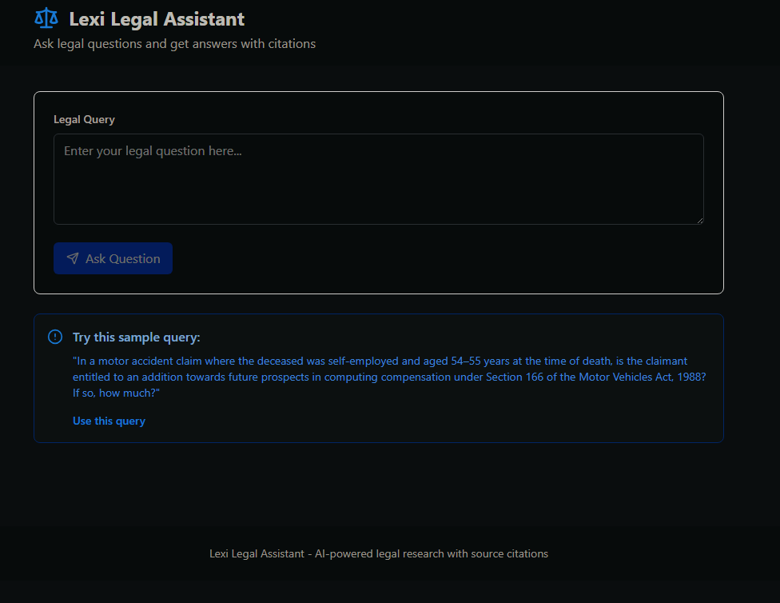

# Lexisg Frontend Intern Test

A legal assistant interface that simulates the Lexi system with citations and PDF linking.

## Setup Instructions

1. Clone the repository

2. Install dependencies:
   npm install

3. Run the development server:
   npm run dev

4. Open the app in your browser:
   http://localhost:5173

## Features

- Legal query input with validation
- Simulated API responses
- Citation system with PDF linking
- Loading states and professional UI
- Sample query for testing

## Citation Handling

Citations are clickable and open the source PDF in a new tab.
The system simulates scrolling to the relevant paragraph inside the document.
